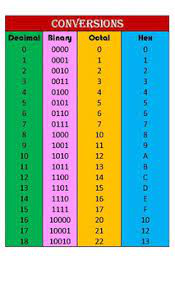

# Number System in Java

<!--
*** Thanks for checking out the Best-README-Template. If you have a suggestion
*** that would make this better, please fork the repo and create a pull request
*** or simply open an issue with the tag "enhancement".
*** Don't forget to give the project a star!
*** Thanks again! Now go create something AMAZING! :D
-->

<!-- PROJECT SHIELDS -->
<!--
*** I'm using markdown "reference style" links for readability.
*** Reference links are enclosed in brackets [ ] instead of parentheses ( ).
*** See the bottom of this document for the declaration of the reference variables
*** for contributors-url, forks-url, etc. This is an optional, concise syntax you may use.
*** https://www.markdownguide.org/basic-syntax/#reference-style-links
-->

<!-- PROJECT LOGO -->
 

  

<!-- ABOUT THE PROJECT -->
# About The Project
This project converts displays a table that converts decimal numbers into binary, octal and hexadecimal. This was an assignment for my CTS 30 course and I wanted
to upload this assignment to github because I thought it was enjoyable to make and to demonstrate that I am capable of programming in Java.

# Built With
This program was made using the online IDE inside of CodeHS and the programming language Java.

<!-- CONTACT -->
# Contact
Nathan Lapak - nathan.lapak@gmail.com  
Project Link: [https://github.com/NateLapak/Number-Systems](https://github.com/NateLapak/Number-Systems)

<!-- ACKNOWLEDGMENTS -->
## Acknowledgments
* [CodeHS](https://codehs.com)

